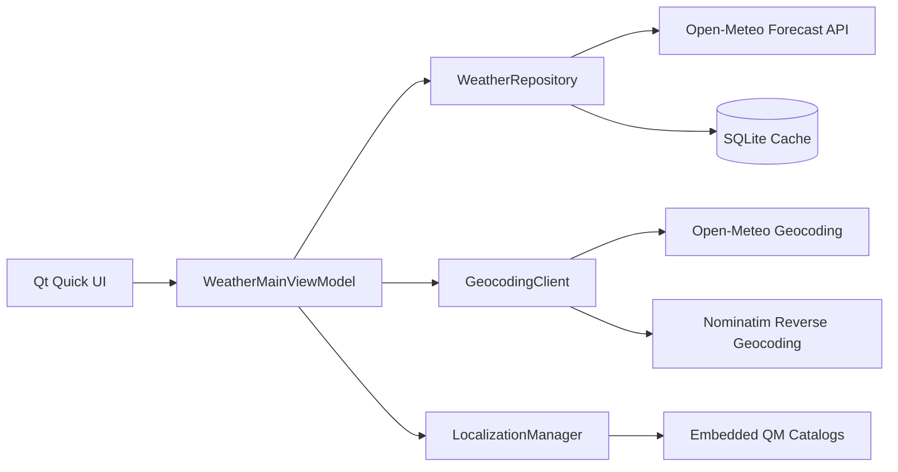

# WeatherScope

WeatherScope is a desktop weather application built with Qt 6, Qt Quick, and Qt Quick 3D. It combines live weather data with an interactive 3D globe, localized location search, hourly and daily forecasts, animated precipitation, and an offline SQLite cache.

## Features

- Interactive 3D Earth with mouse and touch navigation
- Current temperature, humidity, rain chance, wind, and weather condition
- 24-hour forecast timeline and 7-day forecast
- Rain and snow particle effects driven by the current WMO weather code
- City search with localized Open-Meteo geocoding results
- Coordinate-based reverse geocoding through OpenStreetMap Nominatim
- Automatic forecast refresh every 15 minutes
- Offline fallback to the most recently cached forecast
- Runtime language switching without restarting the application
- Eleven UI languages: English, German, French, Simplified Chinese, Dutch, Norwegian, Swedish, Japanese, Korean, Spanish, and Italian

## Technology

- C++20
- Qt 6.8 or newer
- Qt Quick and Qt Quick Controls
- Qt Quick 3D and Qt Quick 3D Particles
- Qt Network and Qt Concurrent
- Qt SQL with SQLite
- CMake 3.21 or newer
- Qt Linguist translation catalogs

## Requirements

Install Qt 6.8 or newer with these components:

- Qt Quick
- Qt Quick 3D
- Qt Quick 3D Particles
- Qt Shader Tools
- Qt Linguist Tools
- Qt SQL SQLite driver
- CMake and Ninja, or another CMake-supported build tool
- A C++20 compiler supported by the selected Qt kit

The project is currently developed with Qt 6.8.3 and MinGW 13.1 on Windows.

No API key is required. An internet connection is needed for live weather and location lookup. Cached weather remains available when the network is unavailable.

## Build With Qt Creator

1. Open `CMakeLists.txt` in Qt Creator.
2. Select a Qt 6.8 or newer Desktop kit.
3. Configure the project when prompted.
4. Build the `weather-globe-qt` target.
5. Run the application from Qt Creator.

The existing `build/` directories are local generated output and are not required when configuring a fresh checkout.

## Build From The Command Line

Use a terminal where Qt and the selected compiler are available on `PATH`.

### Windows with Qt MinGW

```powershell
cmake -S . -B build -G Ninja `
  -DCMAKE_PREFIX_PATH=C:/Qt/6.8.3/mingw_64 `
  -DCMAKE_BUILD_TYPE=Debug
cmake --build build --target weather-globe-qt
.\build\weather-globe-qt.exe
```

Adjust the Qt path and generator to match your installed kit.

### Linux or macOS

```bash
cmake -S . -B build -G Ninja \
  -DCMAKE_PREFIX_PATH=/path/to/Qt/6.8.x/platform \
  -DCMAKE_BUILD_TYPE=Debug
cmake --build build --target weather-globe-qt
./build/weather-globe-qt
```

On macOS, launch the generated application bundle if the selected generator produces one.

## Using The Application

- Search for a city using the field in the top bar, then choose a suggestion.
- Change the interface language from the language selector.
- Drag with the left mouse button to orbit the camera around the globe.
- Drag with the right mouse button to pan.
- Use the mouse wheel or a pinch gesture to zoom.
- Use the refresh button to request updated weather for the selected location.
- Scroll horizontally through the hourly forecast cards.

Selecting a location updates the forecast and centers its marker on the globe. When the language changes, WeatherScope immediately localizes the country name through `QLocale` and then requests localized city and country names for the selected coordinates.

## Data Sources

WeatherScope uses the following public services:

- [Open-Meteo Weather Forecast API](https://open-meteo.com/en/docs) for current, hourly, and daily weather
- [Open-Meteo Geocoding API](https://open-meteo.com/en/docs/geocoding-api) for city suggestions
- [OpenStreetMap Nominatim](https://nominatim.org/release-docs/latest/api/Reverse/) for localized reverse geocoding

Use and distribution of the application must comply with the providers' current terms, usage policies, and attribution requirements.

## Offline Cache

The latest successful raw forecast response is stored in an SQLite database named `weather-cache.sqlite`. The database is created under the platform-specific application data directory returned by `QStandardPaths::AppDataLocation`.

Typical Windows location:

```text
%APPDATA%/WeatherGlobe/weather-globe-qt/weather-cache.sqlite
```

When connectivity is lost, the repository stops network polling and attempts to load this cached forecast. The UI marks cached data separately from live data.

## Architecture



The application follows an MVVM-oriented structure:

- `presentation/` contains QML views, the 3D scene, shaders, and visual assets.
- `include/model/` and `src/model/` contain network, repository, parsing, localization, reachability, and persistence code.
- `include/viewmodel/` and `src/viewmodel/` expose application state and commands to QML.
- `translations/` contains the Qt Linguist `.ts` translation sources.
- `src/main.cpp` creates the services, injects the main view model, and loads the QML module.

## Project Structure

```text
WeatherScope/
|-- CMakeLists.txt
|-- include/
|   |-- model/
|   `-- viewmodel/
|-- presentation/
|   |-- assets/
|   |-- scenes/
|   |-- shaders/
|   `-- views/
|-- src/
|   |-- model/
|   |-- viewmodel/
|   `-- main.cpp
`-- translations/
```

## Localization

Translation sources are stored in `translations/` and compiled into `.qm` files by CMake. The catalogs are embedded under the `:/i18n` resource prefix. `LocalizationManager` installs the selected translator, updates the default `QLocale`, and asks the QML engine to retranslate active bindings.

When editing user-facing text, wrap QML strings with `qsTr()` and C++ strings with `QCoreApplication::translate()` so Qt Linguist can extract them.

## Troubleshooting

### Qt package not found

Set `CMAKE_PREFIX_PATH` to the directory for the Qt kit you intend to use, such as `C:/Qt/6.8.3/mingw_64`. Do not mix Qt libraries and compilers from different kits.

### Missing QML or Quick 3D modules

Open the Qt Maintenance Tool and install Qt Quick 3D, Qt Shader Tools, and the modules listed under Requirements for the selected Qt version.

### Application exits during QML startup

The application treats QML warnings emitted while creating the root object as fatal because the object graph may be incomplete. Read the first warning in the application output; later null-property messages may be teardown effects caused by that initial warning. Warnings emitted after successful startup are logged without terminating the application.

### Live data is unavailable

Verify network access to Open-Meteo and Nominatim. If a cached response exists, WeatherScope will display it and mark the forecast as cached.

## License

This repository does not currently include a standalone license file. Source-file headers state that the code is copyright Abhinay Chauhan and that all rights are reserved. Contact the copyright holder before redistributing or modifying the project outside the permissions granted to you.
